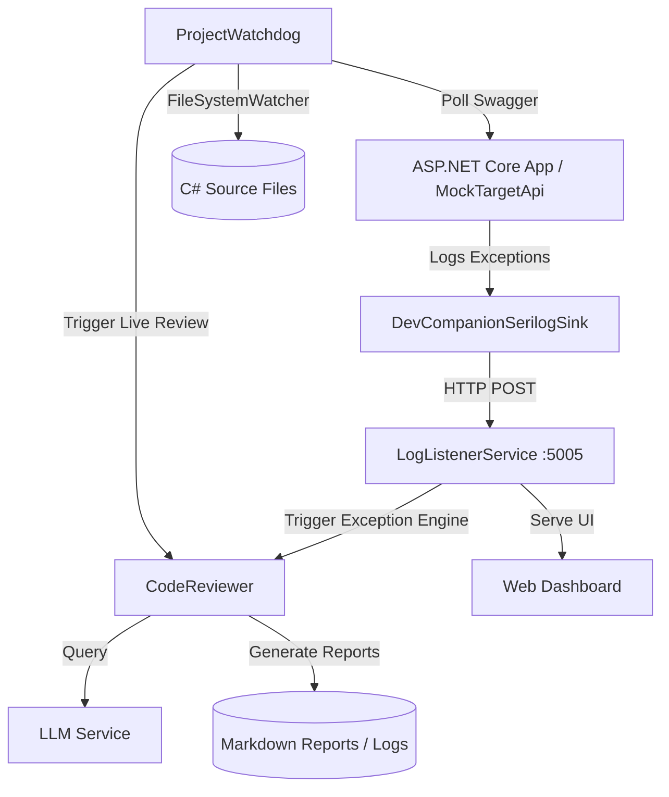

# 🚀 DevCompanion

DevCompanion is a professional, AI-powered developer companion daemon and diagnostic toolkit designed for **.NET 10** and **C# 14** projects. It operates as a local background daemon that monitors your codebase, intercepts runtime exceptions, performs architectural audits, shadow-tests API endpoints, and provides autonomous code repairs directly within your development loop.

---

## 🏗️ Solution Structure

The solution is divided into three main projects, adhering to modular and testable design principles:

```
dev-companion/
├── DevCompanion.Agent/         # Core AI daemon, background watcher, and CLI host
│   ├── Configuration/          # Settings for LLMs, watchers, and projects
│   ├── Integration/            # Custom logging providers and Serilog sink
│   ├── Services/
│   │   ├── Analyzer/           # LLM services, code reviewer, api scanner, and repair tools
│   │   ├── Notification/       # Report generators, Telegram/WhatsApp services
│   │   └── Watcher/            # File system watcher, Git tracker, and log listener daemon
│   └── dashboard.html          # Embedded HTML5 dashboard served by the agent's web server
│
├── MockTargetApi/              # Sample ASP.NET Core API with deliberate vulnerabilities
│   ├── Integration/            # References the custom DevCompanion Serilog Sink
│   └── Program.cs              # Vulnerable endpoints (SQL injection, null references, validation errors)
│
└── DevCompanion.Tests/         # Unit and integration test suite (xUnit, Moq, FluentAssertions)
    └── AgentTests.cs           # Tests for LLM normalization, Git tracker, and architecture validation
```

---

## 🌟 Core Features

DevCompanion hosts 11 core interactive features that can be dynamically toggled via the CLI launcher or the web dashboard:

1. **Live Code Review & Syntax Check**
   * Uses a `FileSystemWatcher` to track C# source edits in real time.
   * Feeds code changes to the configured LLM to generate instant code reviews and logs notes in `AI_AUTOLOG.md`.
2. **Startup Project Structure Audit**
   * Performed on startup to check folder layouts and architectural conventions.
   * Compiles findings into an `AI_PROJECT_AUDIT.md` report.
3. **API Shadow Testing & Fuzzing**
   * Periodically monitors the application's Swagger definition.
   * Automatically targets endpoints with generated fuzzing payloads (e.g., SQL injection, boundary checks) to uncover vulnerabilities, outputting reports to `AI_Vulnerability_Report.md`.
4. **Architecture Drift Detection**
   * Analyzes file references to enforce Clean Architecture boundaries.
   * Detects and warns against layer boundary violations (e.g., when the `Domain` or `Application` layer attempts to import code from `Infrastructure`).
5. **AI Root Cause Exception Engine**
   * Receives runtime exceptions sent via the custom Serilog sink.
   * Analyzes the stack trace and surrounding source code file to generate a root cause analysis and a safe, zero-side-effect C# fix in `AI_BUG_REPORT.md`.
6. **Technical Debt Heatmap Generator**
   * Inspects all C# source files to identify hotspots, mapping out file complexity indices and line-of-code distributions.
7. **AI Memory & Context Preservation**
   * Persists development history, user preferences, and project rules in `.ai/context.json` to retain context across restarts.
8. **Technical Scorecard**
   * Generates a numeric architecture scorecard assessing maintainability, coupling ratio, and boundary compliance.
9. **Autonomous Repair Mode**
   * Safely edits your files to fix compile-time and runtime bugs or apply code improvements based on LLM recommendations.
10. **Project Knowledge Graph Builder**
    * Generates structural diagrams and maps visual dependencies between classes, interfaces, and API endpoints.
11. **Conversation with Code History**
    * Allows asking specific history-related questions about your codebase changes and modifications directly from the command line.

---

## 🔌 How It Works



1. **Custom Serilog Sink:** Your ASP.NET Core application uses the `DevCompanionSerilogSink` to stream warning/error log events containing exceptions directly to the local agent over HTTP.
2. **Background Watchers:** The `ProjectWatchdog` service monitors the filesystem for `.cs` file modifications and polls target HTTP ports to parse Swagger JSON.
3. **Log Listener Daemon:** A hosted `HttpListener` in the agent processes exceptions, serves status reports, accepts feature changes, and streams live logs via Server-Sent Events (SSE) to the built-in Web Dashboard.
4. **LLM Engine Integration:** Interacts with major LLM providers (Gemini, OpenRouter, Groq, Bynara/Mistral) to formulate diagnostic recommendations, draft fixes, and construct code modifications.

---

## 🚀 Getting Started

### 1. Installation

DevCompanion is packaged as a standard **.NET Tool**. You can build the NuGet package and install it locally:

```powershell
# Build and pack the agent project
dotnet pack DevCompanion.Agent/DevCompanion.Agent.csproj -c Release

# Install the tool locally
dotnet tool install --global --add-source ./DevCompanion.Agent/nupkg dev-companion
```

### 2. Configuration

Create or update the `appsettings.json` file in the agent's installation directory (or in the working directory) to specify your preferred LLM provider and project settings:

```json
{
  "AgentSettings": {
    "Llm": {
      "Provider": "Gemini",
      "Gemini": {
        "BaseUrl": "https://generativelanguage.googleapis.com",
        "ApiKey": "YOUR_GEMINI_API_KEY",
        "Model": "gemini-2.5-flash"
      }
    },
    "ListenerPort": 5005,
    "Projects": [
      {
        "RootPath": "d:\\work\\2026\\me\\dev-companion\\MockTargetApi",
        "LocalhostUrl": "http://localhost:5001",
        "SwaggerPath": "/swagger/v1/swagger.json",
        "EnableGitTracking": true,
        "EnableShadowTesting": true
      }
    ]
  }
}
```

### 3. Integrating with Your .NET Project

Install the Serilog sink in your target ASP.NET Core project and register it in `Program.cs`:

```csharp
using DevCompanion.Agent.Integration;
using Serilog;

Log.Logger = new LoggerConfiguration()
    .MinimumLevel.Debug()
    .WriteTo.Console()
    .WriteTo.DevCompanionAgent(
        projectRoot: Directory.GetCurrentDirectory(),
        agentUrl: "http://localhost:5005"
    )
    .CreateLogger();

builder.Host.UseSerilog();
```

---

## 🛠️ CLI Reference & Commands

The agent CLI supports several operational commands and argument flags:

* **Interactive Launcher Menu:**
  ```bash
  dev-companion
  ```
  Launches the interactive ASCII CLI, allowing you to choose which features to activate (or type `all`).

* **Activate Specific Features:**
  ```bash
  dev-companion -f 1,4,5
  ```
  Runs the daemon, auto-activating only features 1 (Live Code Review), 4 (Architecture Drift), and 5 (Root Cause Exception Engine).

* **View Technical Scorecard:**
  ```bash
  dev-companion score
  ```
  Runs a static audit on the working directory, calculates structural metrics, and prints a maintainability scorecard along with a technical debt heatmap.

* **Autonomous Repair / Fix:**
  ```bash
  dev-companion fix
  # or
  dev-companion improve
  ```
  Triggers autonomous repair mode to find outstanding bugs, syntax violations, or warnings in the current directory and resolve them safely.

* **Ask Questions About Codebase History:**
  ```bash
  dev-companion ask "Why was the database connection string modified in the last commit?"
  ```
  Searches the local context history and Git log to explain codebase evolution.

* **Auto-Commit with AI Message:**
  ```bash
  dev-companion commit
  ```
  Reads the latest AI-generated review notes from `AI_AUTOLOG.md` to automatically stage all changes and commit them with a descriptive AI message.

---

## 📊 Live Web Dashboard

When the agent runs, it hosts an embedded dashboard. Open your web browser and navigate to:

👉 **`http://localhost:5005/dashboard`** (or your custom `ListenerPort`)

The dashboard features a premium dark theme and enables you to:
* View live Server-Sent Events (SSE) log notifications.
* Toggle active features on the fly.
* Inspect project files, code review feedback, and vulnerability alerts.
* Trigger scorecard scans and request autonomous repairs directly from the browser.

---

## 📝 Generated Reports

While active, DevCompanion automatically writes and updates standard markdown reports in the root folder of monitored projects:

* **`AI_PROJECT_AUDIT.md`**: Initial clean architecture structure verification.
* **`AI_AUTOLOG.md`**: Live code reviews and suggested git commit messages.
* **`AI_CODE_ERRORS.md`**: Active log of static syntax/semantic errors found during code edits.
* **`AI_MODIFICATIONS.md`**: Historical tracker showing files, line numbers, and diffs applied by the agent.
* **`AI_BUG_REPORT.md`**: Detail sheet for caught exceptions including runtime stack trace and C# fixes.
* **`AI_Vulnerability_Report.md`**: Active records of potential endpoint crashes or SQL injection leaks found during fuzzing.